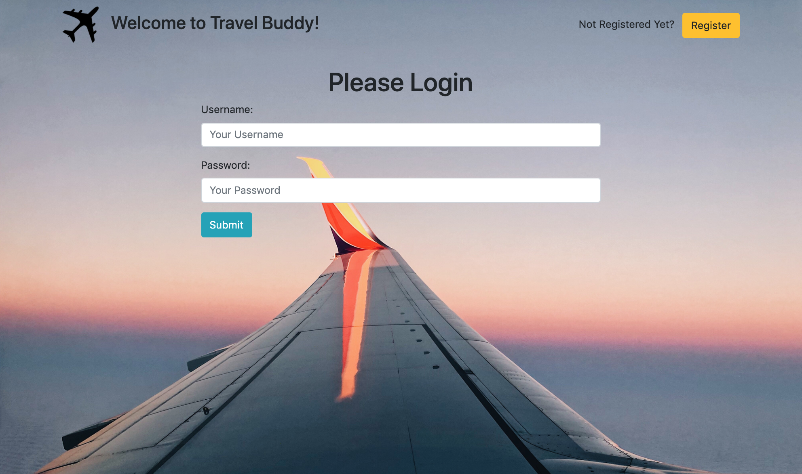

# Project: Travel-Buddy

&nbsp;

## Description

Web app that allows signed in users to plan and add. add or, remove their own scheduled trips and join other trips planned by other users.


&nbsp;

## Technologies:

- Python (ver 3.6.5)
- Django (ver 2.2.15)
- HTML 5
- CSS 3
- JavaScript

&nbsp;

## Usage:




## Install Instructions

Clone repo to your local machine
```python
$ git clone  ....
```

Open a terminal and change directories into the Travel-Buddy/ directory
```python
$ cd Travel-Buddy/
```

Install your preferred python virtual environment with Python version 3.6.5
```python
$ pip install venv
```

Install django application by running
```python
$ pip install -r requirements.txt
```

Run the application
```python
$ cd src/
$ python manage.py runserver
```

&nbsp;

## Maintainers

- Erik Hoversten
- Jose Gonzalez

## License:

Licensed under the MIT license.
