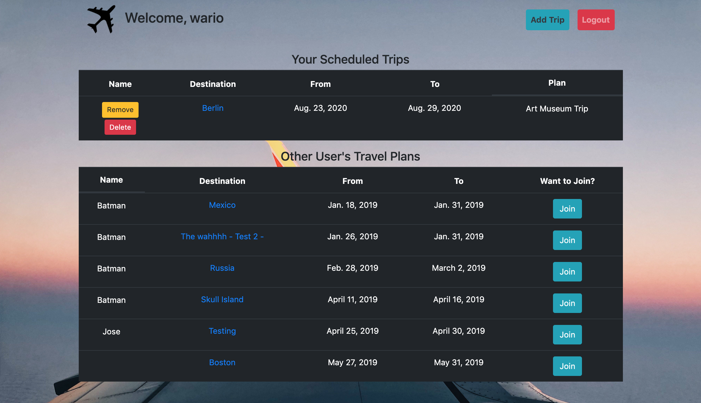
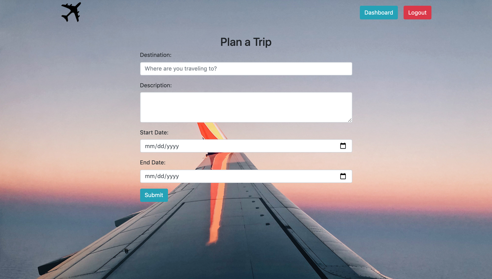

# Project: Travel-Buddy

&nbsp;

## Description

Python and Django based Web application that allows Users to Register and Login. Once authorized Users are able to plan and add a Trip that will be displayed on their dashboard, along with other trips that have been created by other Users. Users then may add or, remove their own scheduled trips and join other planned trips. Only Trips created by the user may be modified or removed.


&nbsp;

## Technologies:

- Python (ver 3.6.5)
- Django (ver 2.2.15)
- HTML 5
- CSS 3
- JavaScript

&nbsp;

## Usage:







## Install Instructions

Clone repo to your local machine
```python
$ git clone  ....
```

Open a terminal and change directories into the Travel-Buddy/ directory
```python
$ cd Travel-Buddy/
```

Install your preferred python virtual environment with Python version 3.6.5
```python
$ pip install venv
```

Install django application by running
```python
$ pip install -r requirements.txt
```

Run the application
```python
$ cd src/
$ python manage.py runserver
```

&nbsp;

## Maintainers

- Erik Hoversten
- Jose Gonzalez

## License:

Licensed under the MIT license.
